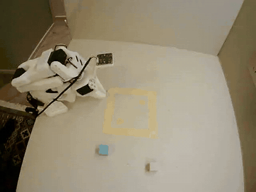
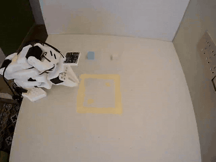
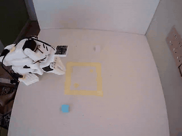

# SO-101 Robot Learning: ACT, Diffusion Policy, and SmolVLA

An end-to-end real-robot learning project built around the SO-101 leader/follower
arms and two RGB cameras. The work progresses from fixed visuomotor imitation
learning to generative action policies and finally language-conditioned
two-cube ordering.

The repository focuses on the engineering loop: task design, teleoperation,
dataset QC, cloud training, guarded deployment, paired evaluation, and
failure-driven iteration. It does **not** claim that every policy solved every
task.

## Real-robot demos

| ACT fixed Pink -> Cyan | SmolVLA Pink -> Cyan | SmolVLA Cyan -> Pink |
|---|---|---|
|  |  |  |

The GIFs are front-camera excerpts accelerated for presentation. Exact source
trials, trims, speed factors, and interpretation limits are recorded in
[`media/README.md`](media/README.md).

## Project stages

| Stage | Task | Policy role | Evidence |
|---|---|---|---|
| Single-cube baseline | Pick and place one cube | ACT | 16/20 complete successes across five positions in the earlier controlled evaluation |
| Generative-policy study | Single-cube grasp | Diffusion Policy | Training and deployment pipeline completed; real-robot gripper behavior remained unreliable, so no success rate is claimed |
| Fixed two-cube sequence | Pink to C1, then Cyan to C2 | ACT | 50 accepted demonstrations, 30K training, and saved autonomous successes; the 32-rollout batch was not outcome-annotated |
| Language-conditioned sequence | Either Pink -> Cyan or Cyan -> Pink | SmolVLA | 122 demonstrations in 61 strict opposite-order pairs, 20K recovery fine-tune, and qualitative successes in both orders |

ACT task strings are metadata only and are not evidence of language
understanding. SmolVLA is language-conditioned, but the current real-robot
screen also showed a Cyan-first bias and inconsistent Pink grasping. The saved
success clips demonstrate capability, not a formal instruction-switch rate.

## Hardware and data interface

- SO-101 follower arm with SO-101 leader teleoperation.
- Fixed front camera and secondary side camera, 640 x 480 at 30 FPS.
- Six-dimensional joint state and action, including the gripper.
- Neutral gray `center target area` bounded by fixed yellow tape.
- `C1` is the first placement point and `C2` is the second; neither is tied to
  a color.
- Camera-visible object names are `pink cube` and `cyan cube`.

The two canonical SmolVLA instructions are intentionally fixed:

```text
First pick up the pink cube and place it in the center target area, then pick up the cyan cube and place it in the center target area.
First pick up the cyan cube and place it in the center target area, then pick up the pink cube and place it in the center target area.
```

## Data and training

### ACT fixed-order two-cube baseline

- Dataset: 50 accepted episodes / 33,205 frames.
- Training: from scratch for 30K steps, batch size 8, fixed seed.
- Model size: 51,597,190 parameters.
- Deployment: guarded joint-relative targets and local video capture.
- Boundary: ACT executes one fixed order and cannot establish language use.

### Diffusion Policy exploration

- Separate earlier single-cube grasp dataset and checkpoint.
- Conditional 1D U-Net predicts an action trajectory by iterative denoising.
- Deployment experiments included synchronous and asynchronous chunked
  inference.
- A tested optional action-chunk blending patch was developed to reduce jumps
  between newly sampled chunks.
- The gripper predictions remained too close to the open range in the audited
  rollout, so this branch is retained as a negative result and engineering
  diagnosis rather than a successful policy.

### SmolVLA recovery-v2

- Base model: `lerobot/smolvla_base` rather than training a VLA from scratch.
- Dataset: 122 episodes / 81,726 frames / 61 strict opposite-order pairs.
- Balance: 61 Pink -> Cyan and 61 Cyan -> Pink episodes.
- Fine-tuning: 20K steps, batch size 8, frozen vision encoder, expert-only
  training.
- Parameters: 450,046,176 total / 99,880,992 trainable.
- Deployment: local RTX 3050, two-camera remapping, 30 Hz recording, and
  per-joint relative-target guards.

## Why three policies?

The policies answer different engineering questions:

- **ACT** provides a compact, deterministic fixed-order imitation-learning
  baseline.
- **Diffusion Policy** models multimodal action trajectories but adds iterative
  inference and chunk-boundary deployment concerns.
- **SmolVLA** introduces visual-language conditioning and pretrained semantic
  features, while making paired language evaluation essential.

See [`reports/policy_comparison.md`](reports/policy_comparison.md) for the
training and deployment comparison.

## Repository map

```text
configs/       experiment templates and local-rig example
commands/      guarded collection, training, and evaluation launchers
scripts/       dataset QC, pairing, training checks, and rollout analysis
manifests/     deterministic episode schedules and data provenance
protocols/     collection, safety, layout, and evaluation rules
reports/       evidence-backed experiment and failure-analysis reports
experiments/   curated policy-specific notes and patches
media/         lightweight, provenance-tracked public demonstrations
```

Raw datasets, checkpoints, calibration files, credentials, W&B state, and full
evaluation videos are intentionally excluded from Git. Dataset/model identifiers
and immutable hashes are retained in the reports where available.

## Reproducibility path

1. Audit the Conda environment with `scripts/check_environment.sh`.
2. Create a private `configs/rig.local.yaml` from `configs/rig.example.yaml`.
3. Validate cameras, schema, labels, and paired schedules before hardware use.
4. Run the 200-step smoke command for the selected policy.
5. Reload the smoke checkpoint before starting a full run.
6. Use the guarded evaluation launchers; they default to dry-run and require
   explicit environment gates for real robot execution.
7. Preserve failures and score them with the documented rubric.

The repository is a project record, not a one-command hardware demo. Read
[`protocols/safety_checklist.md`](protocols/safety_checklist.md) before any
robot action.

## Result boundaries

- The earlier single-cube ACT result was 16/20 under its own fixed evaluation
  protocol; it is not a SmolVLA or two-cube result.
- The two-cube ACT 32-rollout dataset was intentionally left unannotated, so no
  aggregate rate is reported.
- Diffusion Policy is a diagnosed unsuccessful real-robot branch.
- SmolVLA 20K produced successful examples in both directions, but unmatched
  initial poses in parts of the screen prevent a formal aggregate
  instruction-switch claim.
- Training loss and offline language sensitivity were used for debugging, not
  as substitutes for task success.

## License and upstream

The project is built on [LeRobot](https://github.com/huggingface/lerobot).
This repository is released under the [Apache License 2.0](LICENSE). The
included LeRobot compatibility patches retain their upstream project context
and are provided for reproducibility.
